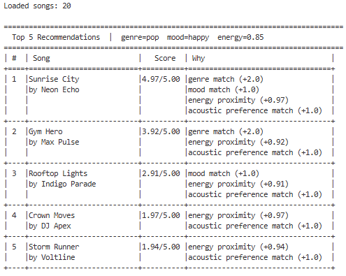
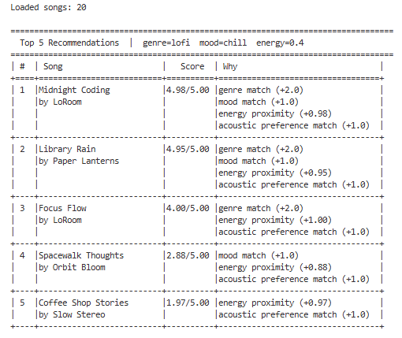
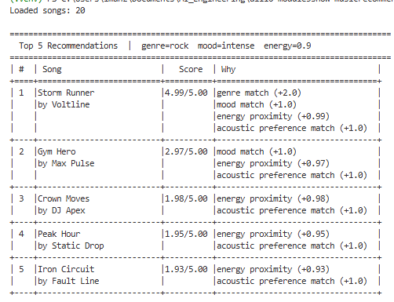
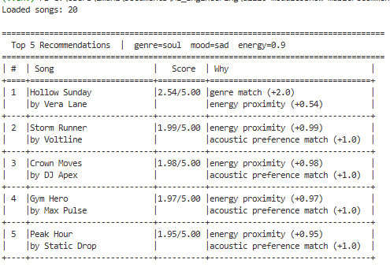
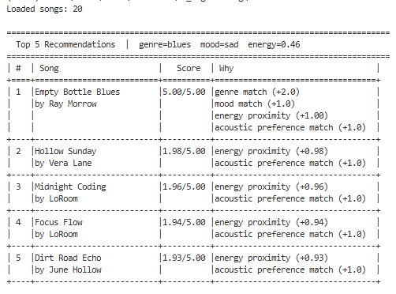
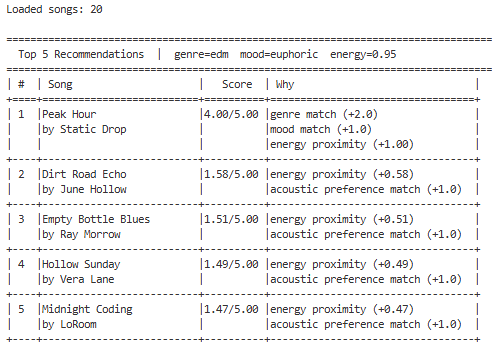

# 🎵 Music Recommender Simulation

## Project Summary

In this project you will build and explain a small music recommender system.

Your goal is to:

- Represent songs and a user "taste profile" as data
- Design a scoring rule that turns that data into recommendations
- Evaluate what your system gets right and wrong
- Reflect on how this mirrors real world AI recommenders

Replace this paragraph with your own summary of what your version does.

---

## How The System Works

Real platforms like Spotify and TikTok watch what you play, skip, and replay across millions of users and use that to figure out what to suggest next. Our version keeps it simpler. Instead of tracking behavior, we look directly at what a song sounds like and compare it to what the user says they want. Every song in the catalog gets a score. The top scoring songs are what we recommend. No mystery, no black box, just math on song attributes.

### What a Song knows about itself

Each `Song` in the catalog stores these features:

- `genre` - the broad style bucket (pop, lofi, rock, jazz, synthwave, ambient, indie pop, hip-hop, r&b, classical, metal, country, soul, edm, folk, latin, blues)
- `mood` - the emotional vibe (happy, chill, intense, relaxed, focused, moody, hyped, romantic, peaceful, angry, nostalgic, melancholic, euphoric, dreamy, uplifting, sad)
- `energy` - how loud and intense the track feels, from 0.0 to 1.0
- `tempo_bpm` - the speed in beats per minute
- `valence` - how musically bright or dark it sounds, from 0.0 to 1.0
- `danceability` - how well it works for moving around, from 0.0 to 1.0
- `acousticness` - how organic vs produced the sound is, from 0.0 to 1.0

### What a UserProfile knows about the listener

Each `UserProfile` stores what the user actually wants:

- `favorite_genre` - the genre they want to hear
- `favorite_mood` - the mood they are going for
- `target_energy` - the energy level they prefer right now
- `likes_acoustic` - whether they want acoustic or produced sound

### The Algorithm Recipe

Every song starts at zero points. Points get added based on how well the song fits the user. The song with the most points at the end wins.

```
score = genre match      (0 or +2.0 points)
      + mood match       (0 or +1.0 points)
      + energy proximity (+0.0 to 1.0 points)
      + acoustic match   (0 or +1.0 points)

max possible score = 5.0
```

**Genre gets the most points (+2.0)** because it is the strongest filter. A lofi fan and a metal fan do not share much, no matter how close the energy is. If genre does not match, two whole points are gone right away.

**Mood is next (+1.0)** because it captures why someone is listening. Someone studying wants focused or chill. Someone working out wants intense or hyped. It matters a lot but it is a little softer than genre.

**Energy uses proximity math (up to +1.0)** instead of a simple yes/no check. The formula is `1.0 - |song.energy - user.target_energy|`. So a song that is right on target gets close to a full point. A song that is way off still gets something, just not much. This is the only rule that gives partial credit on a sliding scale.

**Acoustic preference is a binary check (+1.0)** using 0.5 as the dividing line. Songs above 0.5 acousticness are considered acoustic. Songs below are considered produced or electronic. Listeners who care about this tend to care a lot, so it is worth the same as a mood match.

### How the final list gets picked

After every song has a score, the system sorts them from high to low and returns the top k results. That is it. The scoring rule judges one song at a time. The ranking rule just looks at all the scores together and picks the winners.

### Sample Output

| High-Energy Pop | Lofi/Chill |
|---|---|
|  |  |

| Deep Intense Rock | Edge: Conflicting Preferences (high energy + sad) |
|---|---|
|  |  |

| Edge: Genre with Only One Song | Edge: Acoustic Preference Conflicts with Genre |
|---|---|
|  |  |


### Potential Biases to Watch Out For

This system has a few blind spots worth knowing about before we run it.

**Genre is a hard wall.** A jazz song that is perfect in every other way gets zero genre points if the user asked for lofi. That means genuinely great matches can get buried just because the genre label does not match exactly. A real system would give partial credit for related genres.

**Mood labels are pretty coarse.** There are only a handful of mood options and they have to match exactly. A song tagged "relaxed" scores zero mood points for a user who wants "chill," even though those two things feel almost the same to most people.

**Energy is the only soft signal.** Everything else is a hard yes or no. That means a song can score 4.0 out of 5.0 on genre plus mood plus acoustic alone, and energy barely matters. If two songs both match genre and mood, the one with slightly closer energy wins, but the margin is tiny.

**The catalog is small.** With 20 songs, a user profile that matches only one or two genre/mood combos will always get the same small pool of songs back. There is not much room for surprise or variety.


---

## Getting Started

### Setup

1. Create a virtual environment (optional but recommended):

   ```bash
   python -m venv .venv
   source .venv/bin/activate      # Mac or Linux
   .venv\Scripts\activate         # Windows

2. Install dependencies

```bash
pip install -r requirements.txt
```

3. Run the app:

```bash
python -m src.main
```

### Running Tests

Run the starter tests with:

```bash
pytest
```

You can add more tests in `tests/test_recommender.py`.

---

## Experiments You Tried

We halved the genre weight from +2.0 to +1.0 and doubled the energy weight to max +2.0. The number one result stayed the same for every profile but the scores below it got much closer together. Songs from the wrong genre almost caught up to correct ones just because their energy was slightly closer. That showed how much the genre weight is doing to keep the results sensible.

We also tested six different user profiles including three edge cases. A blues user with one matching song got one real result and four filler songs. A soul user who wanted high energy got the genre match at number one but with a low score, and then high-energy songs from totally different genres filling the rest of the list. The system had no way to flag that those preferences were contradictory.

---

## Limitations and Risks

The catalog only has 20 songs and most genres have just one. That means users who like blues, metal, folk, or any other underrepresented genre get mostly filler results after the first pick.

Mood and genre matching are exact string checks so similar labels like chill and relaxed score zero against each other even though they feel basically the same.

The system has no way to detect conflicting preferences. If a user asks for sad music but with very high energy it will just keep scoring and return confident-looking results that do not actually make sense together.

It also does not understand anything about what music actually sounds like. It works off numbers and labels only, so if those labels are wrong or missing the whole thing falls apart.

---

## Reflection

Read and complete `model_card.md`:

[**Model Card**](model_card.md)

The main thing this project showed is that a recommender does not need to understand what it is recommending. It just needs good labels and numbers. When the features are chosen well, doing arithmetic on them produces results that feel surprisingly smart. The system has no idea what lofi music sounds like but it learned to surface the right songs anyway because energy, acousticness, and genre labels happen to capture the things that matter to a lofi listener.

The place where bias shows up most easily is in the data, not the algorithm. The scoring logic treats every genre equally but the catalog does not represent every genre equally. That gap is enough to give some users a genuinely worse experience than others without any intentional decision being made. In a real product that kind of imbalance would be hard to spot unless you specifically went looking for it by testing with profiles that represent underserved groups.


---

## 7. `model_card_template.md`

Combines reflection and model card framing from the Module 3 guidance. :contentReference[oaicite:2]{index=2}  

```markdown
# 🎧 Model Card - Music Recommender Simulation

## 1. Model Name

Give your recommender a name, for example:

> VibeFinder 1.0

---

## 2. Intended Use

- What is this system trying to do
- Who is it for

Example:

> This model suggests 3 to 5 songs from a small catalog based on a user's preferred genre, mood, and energy level. It is for classroom exploration only, not for real users.

---

## 3. How It Works (Short Explanation)

Describe your scoring logic in plain language.

- What features of each song does it consider
- What information about the user does it use
- How does it turn those into a number

Try to avoid code in this section, treat it like an explanation to a non programmer.

---

## 4. Data

Describe your dataset.

- How many songs are in `data/songs.csv`
- Did you add or remove any songs
- What kinds of genres or moods are represented
- Whose taste does this data mostly reflect

---

## 5. Strengths

Where does your recommender work well

You can think about:
- Situations where the top results "felt right"
- Particular user profiles it served well
- Simplicity or transparency benefits

---

## 6. Limitations and Bias

Where does your recommender struggle

Some prompts:
- Does it ignore some genres or moods
- Does it treat all users as if they have the same taste shape
- Is it biased toward high energy or one genre by default
- How could this be unfair if used in a real product

---

## 7. Evaluation

How did you check your system

Examples:
- You tried multiple user profiles and wrote down whether the results matched your expectations
- You compared your simulation to what a real app like Spotify or YouTube tends to recommend
- You wrote tests for your scoring logic

You do not need a numeric metric, but if you used one, explain what it measures.

---

## 8. Future Work

If you had more time, how would you improve this recommender

Examples:

- Add support for multiple users and "group vibe" recommendations
- Balance diversity of songs instead of always picking the closest match
- Use more features, like tempo ranges or lyric themes

---

## 9. Personal Reflection

A few sentences about what you learned:

- What surprised you about how your system behaved
- How did building this change how you think about real music recommenders
- Where do you think human judgment still matters, even if the model seems "smart"

